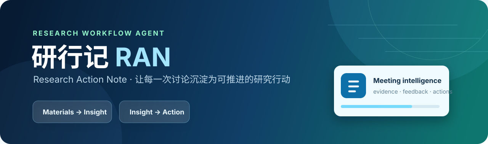

<div align="center">
  

  <br />

  [English](README_EN.md) · 中文

  <p><strong>一场组会结束了，真正重要的研究工作才刚刚开始。</strong></p>
  <p>研行记把语音转写、PPT、PDF 与现场讨论整理成一份有出处、能复盘、可继续推进的研究行动记录。</p>

  <a href="https://yanxingji-ran.onrender.com/app/demo.html"></a>
  <a href="https://github.com/zhongshiyu0129/lab-meeting-copilot"></a>

  <br /><br />

  
  
  
  
</div>

---

## 先体验，再读文档

打开 **[研行记公开体验版](https://yanxingji-ran.onrender.com/app/demo.html)**，点击右上角「加载官方试用案例」，即可用内置的“猪周期”组会材料走完一遍真实流程：

1. 载入语音转写、研究汇报 PPT 和参考文献 PDF；
2. 核对汇报人与材料归属；
3. 生成核心讨论、导师反馈、风险与行动项；
4. 点击引用编号，回到对应的 PPT/PDF 页面，查看黄色高亮的证据位置；
5. 将结果保存到资料库，继续编辑或导出。

公开体验版已经在服务端配置模型额度，访客无需填写 API Key。Render 免费实例闲置后会休眠，首次打开可能需要等待约 30–60 秒。

> 公开站点是共享演示环境，请优先使用内置案例，不要上传未公开、涉密或含个人信息的研究材料。个人研究资料建议在本地运行。

## 为什么是「研行记」

组会里最有价值的内容，常常不是最后那段摘要，而是散落在不同介质中的研究脉络：PPT 上的一张实验图、论文里的一段结论、导师追问的一个变量，以及下周必须补做的验证。

普通会议纪要把它们压成一段“听起来合理”的文字；研行记试着做另一件事——让每个重要判断都能沿着证据链回到原始材料，让一次讨论真正变成下一次行动的起点。

```text
语音转写 + PPT + PDF / DOCX
              ↓
      解析、整理、汇报人绑定
              ↓
   多模态模型理解文字、图表与版式
              ↓
讨论要点 · 导师反馈 · 风险 · 行动项
              ↓
   页码级溯源 · 原页高亮 · 资料库沉淀
```

模型负责理解，应用负责约束：输入材料、结构字段、证据页码、文件预览和行动项状态都由产品流程管理。结果不是一次性的 AI 回复，而是一份可以检查、修改和继续推进的研究记录。

## 当前已实现

| 能力 | 现在可以做什么 |
| :-- | :-- |
| **多模态材料接入** | 导入转写文本、DOCX、PPT/PPTX 与 PDF；保留人工核对汇报人与材料归属的步骤。 |
| **科研图表理解** | 将 PPT/PDF 页面图像连同文字一起交给多模态模型，优先选择包含图表、实验与模型信息的页面。 |
| **结构化组会纪要** | 按汇报人和主题生成讨论要点、导师反馈、风险提示与后续行动项。 |
| **页面级证据溯源** | 使用结构化页码定位来源；在原始 PPT/PDF 页面中以黄色高亮或边框标出命中区域。 |
| **真实文件预览** | PPT 通过 LibreOffice 渲染，PDF 直接按页成像；支持缩略图、整页大图和原文件查看。 |
| **研究行动闭环** | 保存负责人、期限、优先级、状态与回应，并在资料库中查看历史记录和未完成事项。 |
| **一键官方案例** | 内置“猪周期”研究组会材料，不准备任何文件也能体验完整链路。 |

## 本地运行

### macOS 一键启动

1. 复制配置模板：`cp ran-backend/.env.example ran-backend/.env`。
2. 在 `ran-backend/.env` 填写自己的模型服务密钥。
3. 在 Finder 中双击 [启动研行记.command](启动研行记.command)。
4. 首次启动会自动创建 Python 环境并安装依赖，随后打开 Demo 页面。

保持启动终端开启；关闭终端即停止本地服务。

### 手动启动

```bash
cd ran-backend
python3 -m venv .venv
./.venv/bin/python -m pip install -r requirements.txt
./.venv/bin/python -m uvicorn main:app --host 127.0.0.1 --port 8003
```

浏览器访问 `http://127.0.0.1:8003/app/demo.html`。前后端由同一个 FastAPI 服务提供，不需要再启动单独的静态服务器。

## 模型配置

项目支持 OpenAI 兼容接口。当前示例使用 OpenRouter 上的 `deepseek/deepseek-v4.1-flash`：

```dotenv
OPENAI_API_KEY=your_openrouter_key
OPENAI_BASE_URL=https://openrouter.ai/api/v1
OPENAI_MODEL=deepseek/deepseek-v4.1-flash
VISION_INPUT_ENABLED=true
VISION_MAX_IMAGES=18
```

如使用其他服务商，请同时替换 `OPENAI_BASE_URL`、`OPENAI_MODEL` 和对应 Key。模型选型说明见 [模型推荐.md](ran-backend/模型推荐.md)。

## 部署公开体验版

仓库根目录的 [Dockerfile](Dockerfile) 可直接部署到 Render 等容器平台。线上服务需要在平台控制台添加以下环境变量：

| 变量 | 示例 | 说明 |
| :-- | :-- | :-- |
| `OPENAI_API_KEY` | 在平台 Secret 中填写 | 必填；只保存在服务端，绝不要写进仓库。 |
| `OPENAI_BASE_URL` | `https://openrouter.ai/api/v1` | OpenAI 兼容接口地址。 |
| `OPENAI_MODEL` | `deepseek/deepseek-v4.1-flash` | 当前使用的多模态模型。 |
| `VISION_INPUT_ENABLED` | `true` | 是否向模型发送页面图像。 |
| `VISION_MAX_IMAGES` | `18` | 单次生成最多送入模型的视觉页数。 |

部署后的 `/health` 会返回 `model_configured: true/false`，便于确认服务端是否读到密钥，但不会返回密钥本身。

真实 API Key 只应出现在本机 `ran-backend/.env` 或部署平台的 Secret/Environment 面板中。本仓库通过 `.gitignore` 与 `.dockerignore` 双重排除 `.env`；前端代码、Git 历史和浏览器网络响应都不包含密钥。公开演示会消耗维护者的模型额度，建议同时在模型服务商后台设置消费上限与告警。

## 项目结构

```text
lab-meeting-copilot/
├── ran-page 3/             # 产品主页与交互式 Demo
├── ran-backend/
│   ├── main.py             # FastAPI、材料解析、模型编排、溯源与资料库接口
│   ├── trial_assets/       # 内置官方演示素材
│   ├── requirements.txt    # Python 依赖
│   └── .env.example        # 不含真实密钥的配置模板
├── 测试材料_三人组会/        # 可手动上传的本地测试包
├── Dockerfile              # 公网容器部署
└── 启动研行记.command       # macOS 一键启动入口
```

## 隐私与边界

- API Key 仅由后端读取；`.env`、生成记录数据库与上传文件均已从 Git/Docker 构建上下文排除。
- 当前公开版是产品演示，不是带账号隔离的多用户系统；请勿在公开站点处理敏感材料。
- AI 结果用于辅助梳理和推进研究，不能替代研究者对实验、数据、引用和结论的最终核验。
- 内置案例仅用于产品体验；处理自有材料前，请确认拥有相应的使用与分享权限。

## 下一步

- [x] 多来源材料解析与结构化纪要
- [x] PPT/PDF 真页预览与页面级黄色溯源
- [x] 多模态图表理解与视觉页面优先选择
- [x] 行动项闭环与本地资料库
- [x] 一键官方演示案例与公开体验站点
- [ ] 团队账号、权限与数据隔离
- [ ] 可编辑的细粒度证据框与人工校正
- [ ] 跨项目研究记忆与协作工作流

## License

Released under the [MIT License](LICENSE).

## Contact

Built by [@zhongshiyu0129](https://github.com/zhongshiyu0129). Issues and pull requests are welcome.
